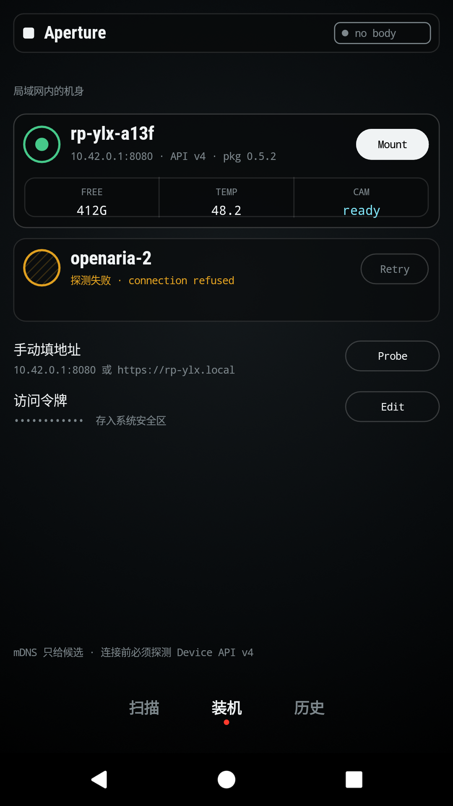
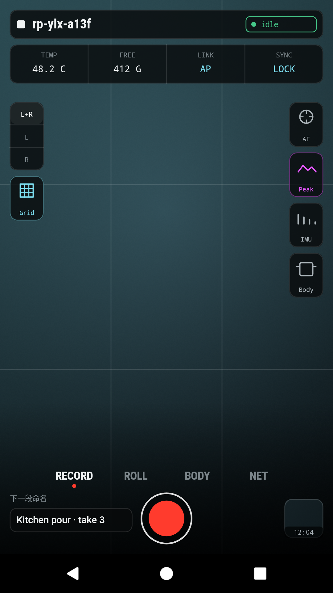
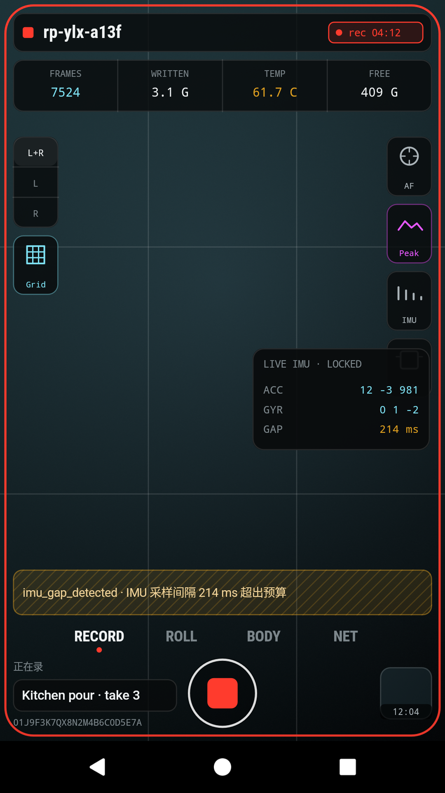
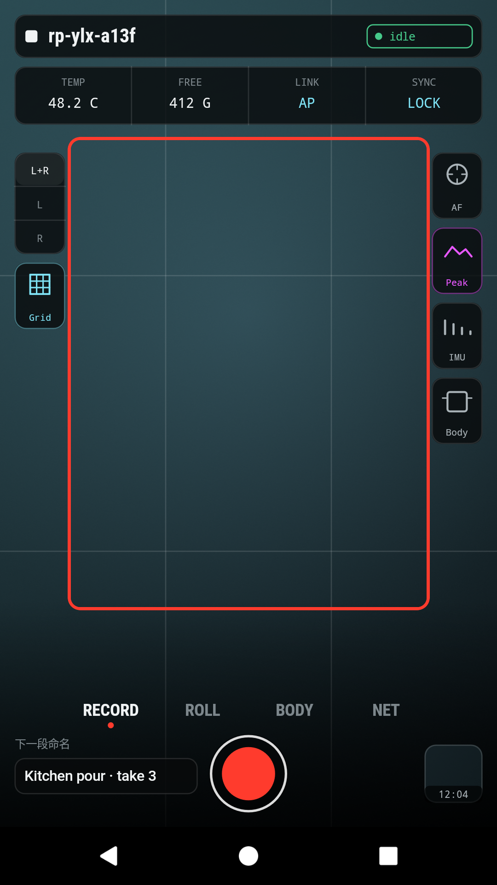
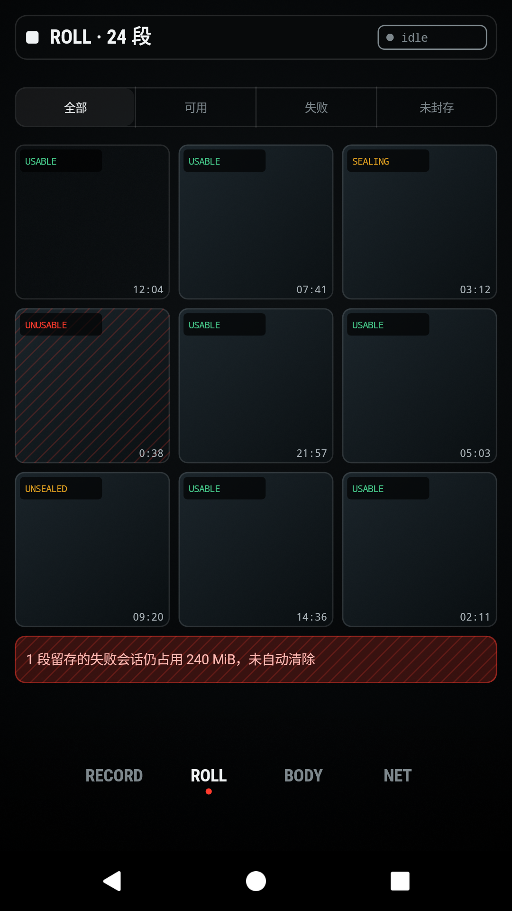
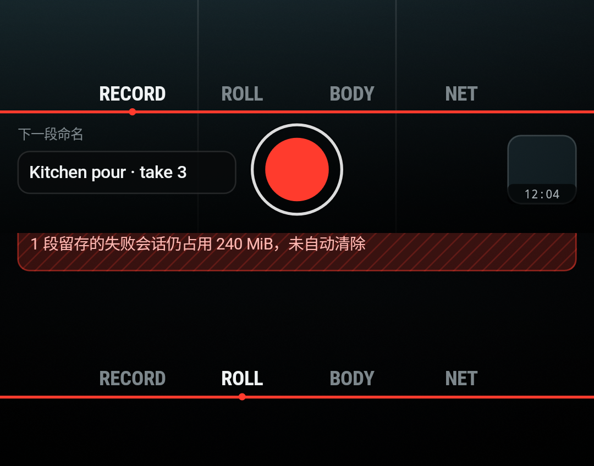
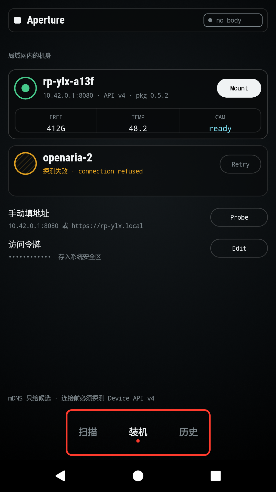
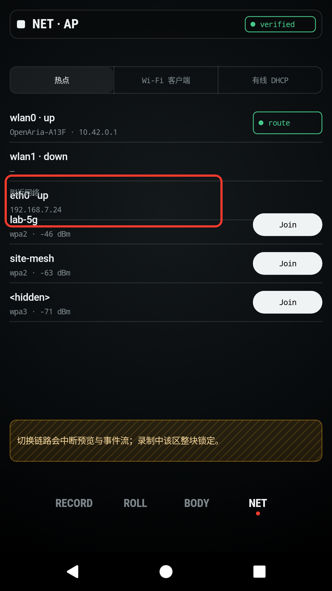
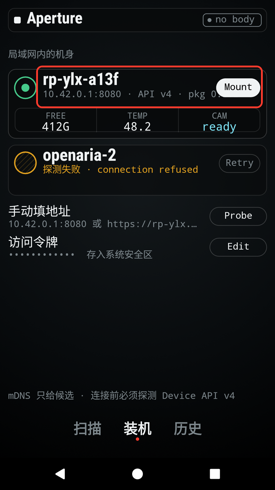
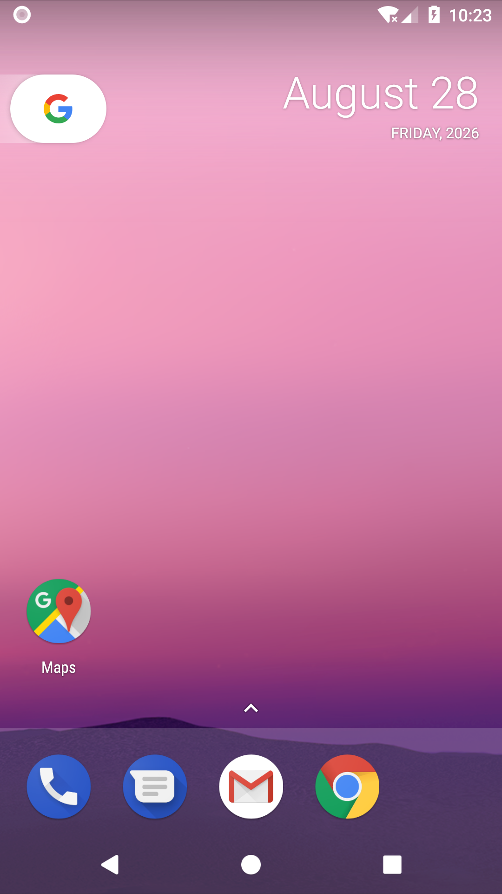

# Open Aria Echo Mobile 界面与功能审查

| Field | Value |
|-------|-------|
| **Date** | 2026-08-28 |
| **App** | `android://com.openaria.openaria_echo_mobile` |
| **Session** | `openaria-echo-api26-software` |
| **Scope** | 顶部/底部导航、安全区、视频流、设备控制、文案与 i18n、响应式、可访问性、返回路径、令牌安全 |
| **Palette** | 用户明确满意；本报告不建议改变现有配色 |

## Summary

| Severity | Count |
|----------|-------|
| Critical | 2 |
| High | 6 |
| Medium | 2 |
| Low | 0 |
| **Total** | **10** |

本次不是普通的界面打磨问题。当前 APK 实质上是一个可点击的高保真 Canvas 原型：设备发现、挂载、录制、焦点、网络和会话数据大多是硬编码展示或本地布尔状态，没有真实 Device API 或视频链路。优先级应先回到功能真实性和应用框架，再处理文案与细节。

## Environment And Limits

- 最新源码通过 `./gradlew assembleDebug` 构建，并安装到 Pixel 2 配置的 API 26 软件模拟器，分辨率为 1080x1920、密度为 420 dpi。
- 额外在系统字体缩放 1.5 倍下复查；完成后已恢复默认设置。
- API 35 AVD 因当前用户无 `/dev/kvm` 权限而无法启动；API 26 软件 AVD可以启动，但 `screenrecord` 编码器返回 `err=-38`。因此交互问题用逐步截图和像素断言留证，没有伪造视频。
- 当前 AVD 没有显示开孔。顶部开孔问题由用户真机症状、全屏窗口配置和缺失 inset 处理共同确认，报告中明确标为静态确认。

## Issues

### ISSUE-001: 无设备连接也会显示“正在录制”和伪造指标

| Field | Value |
|-------|-------|
| **Severity** | critical |
| **Category** | functional |
| **Screen** | 设备选择 -> RECORD |
| **Repro Video** | N/A；软件 AVD 编码器不可用，使用逐步截图 |

**Description**

模拟器无法访问画面中写死的 `10.42.0.1:8080`，应用却始终展示一台 `ready` 设备。点击 `Mount` 会立即进入取景器，点击快门又会立即显示 `rec 04:12`、`7524 FRAMES`、`3.1 G WRITTEN` 等固定成功数据。预期行为是完成设备探测、鉴权、挂载和录制命令确认后才进入相应状态；任何失败都必须保留在可见错误态。当前行为可能让用户误以为真实素材正在写入，存在直接丢失拍摄结果的风险。

源码根因：`mount` 只设置 `mounted = true`，`shutter` 只切换 `recording`；所有设备与录制指标均为硬编码。见 `MainActivity.java:132-143`、`:207-226`、`:247-264`。

**Repro Steps**

1. 启动应用，观察无需网络探测就出现固定的 `ready` 设备。
   

2. 点击该设备的 `Mount`，立即进入取景器，没有连接或加载状态。
   

3. 点击红色快门。

4. **Observe:** 界面立即报告正在录制和固定帧数、写入量、温度及 IMU 数据。
   

---

### ISSUE-002: 没有视频流连接、解码或渲染链路

| Field | Value |
|-------|-------|
| **Severity** | critical |
| **Category** | functional |
| **Screen** | RECORD |
| **Repro Video** | N/A；静态结果足以显示故障 |

**Description**

取景区始终只显示渐变背景和构图网格，没有视频帧，也没有“连接中 / 缓冲 / 失败 / 重试”状态。预期是挂载成功后展示来自设备的实际左右目视频，并对连接、首帧、断流和重连给出明确反馈。

源码根因：`drawViewfinder()` 只调用 `RadialGradient`、`LinearGradient`、`drawRect()` 和网格线绘制；项目没有 `SurfaceView`、`TextureView`、`MediaCodec`、Media3、WebRTC、RTSP、MJPEG 或设备流客户端依赖。唯一的 `HttpURLConnection` 位于应用更新模块。见 `MainActivity.java:478-510` 与 `app/build.gradle.kts`。

**Repro Steps**

1. 在设备选择页点击 `Mount`。

2. 等待取景器出现。

3. **Observe:** 标注区域内没有任何视频内容或流状态。
   

---

### ISSUE-003: 顶部 HUD 未避让状态栏和摄像头开孔

| Field | Value |
|-------|-------|
| **Severity** | high |
| **Category** | visual |
| **Screen** | 全部页面 |
| **Repro Video** | N/A；用户真机复现，源码静态确认 |

**Description**

主题强制 `android:windowFullscreen=true`，顶部 HUD 固定从屏幕 `12dp` 开始绘制，应用中没有 `WindowInsets`、`DisplayCutout`、`safeInsetTop` 或系统栏避让逻辑。带居中开孔的设备会让标题栏与摄像头区域重合；Android 新版本强制边到边后，底部也存在落入系统导航区的同类风险。

预期是用系统 inset 计算内容安全区：背景可以全屏，交互和文字必须在 `max(statusBars, displayCutout)` 之后布局。当前配色和沉浸式背景可以完全保留。

源码根因：`styles.xml:6` 开启全屏；`MainActivity.java:512-524` 使用固定 `dp(12)` / `dp(48)`；全仓库没有 inset API。

**Repro Steps**

1. 在带居中开孔的 Android 真机打开任意页面。

2. **Observe:** 顶部 HUD 占用屏幕最上方区域。当前无开孔 AVD 也可见 HUD 直接贴近物理顶边。
   

---

### ISSUE-004: RECORD 与其他模式的底部导航相差 95 像素

| Field | Value |
|-------|-------|
| **Severity** | high |
| **Category** | visual / ux |
| **Screen** | RECORD、ROLL、BODY、NET |
| **Repro Video** | N/A；软件 AVD 编码器不可用，提供逐步截图与自动断言 |

**Description**

从 `RECORD` 切换到 `ROLL`、`BODY` 或 `NET` 时，四个模式入口整排向下跳。像素断言两次均测得 `RECORD` 激活点位于 `y=1573`，`ROLL` 位于 `y=1668`，差值为 95 像素。预期四个入口始终固定在同一安全基线，页面内容只在导航上方变化。

源码根因：`drawRecordBottom()` 用 `h - dp(92)`，`drawModeBottom()` 用 `h - dp(56)`。见 `MainActivity.java:569-626`。

**Repro Steps**

1. 挂载后停留在 `RECORD`。
   

2. 点击 `ROLL`。
   

3. **Observe:** 整排导航下移；对比图红线穿过各自激活点。
   

4. 运行 `bash dogfood-output/check_bottom_nav.sh`，脚本以退出码 1 报告 `Navigation shift: 95 px`。

---

### ISSUE-005: 大量可见按钮和底部入口没有任何点击行为

| Field | Value |
|-------|-------|
| **Severity** | high |
| **Category** | functional / ux |
| **Screen** | 设备选择、ROLL、NET、Focus、会话详情 |
| **Repro Video** | N/A；前后截图完全一致 |

**Description**

设备选择页的“扫描”“历史”、`Retry`、`Probe`、`Edit`，ROLL 筛选，NET 页签和三个 `Join`，Focus 的自动/手动与旋钮，详情页的 `Copy URL` 都看起来可操作，但没有热点或实现。预期所有呈现为按钮、页签、分段控件或输入操作的元素都能响应，并有禁用、加载、成功或错误反馈。

点击“扫描”前后的 PNG SHA-256 完全相同：`06464da5...90e7be2`。源码中 `drawMountBottom()` 只画文字；通用 `drawLineItem()` 只画操作胶囊，从不注册热点。见 `MainActivity.java:629-646`、`:696-711`。

**Repro Steps**

1. 启动应用并点击底部“扫描”。
   

2. **Observe:** 页面、选中态和内容完全不变。
   

---

### ISSUE-006: 没有 i18n 体系，默认界面中英混排

| Field | Value |
|-------|-------|
| **Severity** | high |
| **Category** | content / ux |
| **Screen** | 全部页面 |
| **Repro Video** | N/A；首屏即可见 |

**Description**

界面同时出现“局域网内的机身 / Mount / Retry / Probe / Edit / connection refused / no body / FREE / TEMP”等文字。仓库中只有一个 `values/strings.xml`，且仅含英文应用名；扫描到至少 72 处直接传给绘制方法的可见硬编码文案。语言跟随系统或应用设置均不会改变这些文字。

预期第一阶段只支持简体中文和英文：默认资源 `values/strings.xml` 使用中文，`values-en/strings.xml` 提供英文；状态、错误、按钮、无障碍描述和更新模块全部通过资源键获取。`API`、`Wi-Fi`、`mDNS`、`IMU`、`SHA-256`、设备 ID、协议名和文件路径等专有名词保留英文。

**Repro Steps**

1. 启动应用。

2. **Observe:** 同一信息层级内持续中英混排，且没有语言设置。
   

---

### ISSUE-007: 固定 Canvas 布局在默认页已重叠，放大字体后进一步遮挡

| Field | Value |
|-------|-------|
| **Severity** | medium |
| **Category** | visual / accessibility |
| **Screen** | NET、设备选择及其他固定尺寸页面 |
| **Repro Video** | N/A；静态可见 |

**Description**

默认字体下，NET 页的“附近网络”直接压在 `eth0 · up` 上，第一条 `lab-5g` 又侵入同一区域。系统字体调到 1.5 倍后，设备地址和版本被 `Mount` 按钮遮住。应用没有滚动容器或内容测量，页面高度、卡片高度和文本基线均为固定 dp。

NET 的直接根因是绘制完 48dp 高的 `eth0` 行后只执行 `y += dp(18)`，而不是先越过整行。字体问题则来自文本使用 sp、容器仍使用固定 dp 且部分文本没有宽度约束。见 `MainActivity.java:372-387`、`:923-953`。

**Repro Steps**

1. 挂载后进入 `NET`。
   

2. 将系统字体缩放设置为 1.5，重启应用。

3. **Observe:** 设备元数据与 `Mount` 按钮相互遮挡。
   

---

### ISSUE-008: 整个应用对无障碍服务只暴露为一个无名称 View

| Field | Value |
|-------|-------|
| **Severity** | high |
| **Category** | accessibility |
| **Screen** | 全部页面 |
| **Repro Video** | N/A；可访问性树证据 |

**Description**

UI Automator 树中，应用内容只有一个 `android.view.View`，标记为 `NAF=true`，没有文本、内容描述、角色、选中态或独立可点击节点。屏幕阅读器无法理解或操作设备、快门、模式、网络、更新和表单；键盘/开关控制同样无法逐项聚焦。

预期每个控制项有独立语义、可读名称、角色、状态和至少 48dp 的稳定触控目标。若取景画面继续使用 Canvas，周围控制应迁移到原生 View 层；Canvas 内必须实现 `ExploreByTouchHelper` 虚拟节点。

**Evidence**

可访问性树保存在 [`window.xml`](window.xml)，根内容下只有一个无名称、整体 clickable 的 View。

---

### ISSUE-009: 系统返回键从取景器直接退出应用

| Field | Value |
|-------|-------|
| **Severity** | medium |
| **Category** | ux |
| **Screen** | RECORD、ROLL、BODY、NET |
| **Repro Video** | N/A；逐步截图 |

**Description**

挂载后的四个模式都没有明确的“返回设备列表 / 卸载机身”入口。按系统返回键会直接回到桌面，而不是关闭底部弹层、停止或确认录制、卸载设备，再回到设备选择页。真实录制接入后，这会形成状态不明和误退出风险。

**Repro Steps**

1. 挂载设备并进入任意模式。

2. 按系统返回键。

3. **Observe:** 应用直接退出到桌面。
   

---

### ISSUE-010: “访问令牌存入系统安全区”是未实现承诺，且全局允许明文流量

| Field | Value |
|-------|-------|
| **Severity** | high |
| **Category** | functional / security |
| **Screen** | 设备选择 |
| **Repro Video** | N/A；源码与首屏静态确认 |

**Description**

界面声称访问令牌“存入系统安全区”，但 `Edit` 没有点击热点，应用没有输入控件、Keystore、加密首选项或任何令牌存取代码。同时清单全局设置 `android:usesCleartextTraffic=true`，默认候选地址又是明文 `10.42.0.1:8080`。当前认证流程无法使用；未来若直接接入，令牌可能在局域网明文传输。

预期令牌通过 Android Keystore 支持的存储实现，日志和错误不得泄漏；优先使用 HTTPS。确需本地 HTTP 时，应使用作用域明确的 Network Security Config、显示风险，并避免把全应用的明文流量全部打开。

**Evidence**

全仓库搜索 `SharedPreferences`、`EncryptedSharedPreferences`、`KeyStore`、`SecretKey`、`Credential`、`token` 均无实现；全局明文开关位于 `AndroidManifest.xml:17`。

## Additional Repository Findings

- `./gradlew lintDebug` 通过，但报告有 6 个警告，包括锁定竖屏在 Android 16 上会被忽略、备份规则缺失等。自绘 View 的硬编码文字和无障碍问题没有被标准 Lint 捕获。
- `./gradlew testDebugUnitTest --info` 显示 `compileDebugUnitTestJavaWithJavac NO-SOURCE` 和 `testDebugUnitTest NO-SOURCE`。CI 中名为 `Test` 的步骤因此会绿色通过，但当前仓库测试数为 0。
- 1089 行的 `MainActivity.java` 同时承担绘制、交互、模拟数据、导航和更新入口，没有可替换的 Device API、媒体或状态边界，也没有适合回归测试的接口。
- 运行日志中没有视频或设备连接错误，不是链路健康，而是应用根本没有发起这些操作。

## Recommended Order

1. **P0：功能真实性。** 明确 Device API v4 的发现、鉴权、挂载、状态订阅、录制命令和错误契约；用状态机替换硬编码数据。未收到设备确认时绝不能显示 `ready`、`recording` 或写入量。
2. **P0：视频链路。** 先确定设备实际协议，再采用对应的成熟 Android 媒体库；实现连接、首帧、缓冲、超时、断流、重连和左右目切换。Canvas 只保留取景器叠加层，不负责媒体解码。
3. **P1：稳定应用框架。** 引入系统 inset，顶部按开孔/状态栏安全区布局；底部导航固定在同一安全基线；返回键按“关闭弹层 -> 确认录制 -> 卸载 -> 退出”处理。
4. **P1：i18n。** 默认中文资源放在 `values/strings.xml`，英文放在 `values-en/strings.xml`；补应用内语言设置和持久化。专有名词保留英文，普通动作、状态和错误用中文。
5. **P1：可操作控件。** 把页签、按钮、输入、列表和底栏移到原生 View 层，补真实行为、禁用/加载/错误态、48dp 触控目标和无障碍语义。
6. **P2：响应式与回归。** 修复 NET 坐标错误，支持字体缩放、小屏、长屏、分屏和 Android 16 尺寸变化；为状态机、i18n 完整性、inset、底栏基线、设备连接和视频首帧加入自动化测试。

## Acceptance Signals

- `bash dogfood-output/check_bottom_nav.sh` 从当前的 `FAIL: 95 px` 变为 `PASS`。
- 带居中开孔的 API 35+ 设备上，顶部交互内容完全位于 cutout/status bar 安全区内；底栏位于 navigation bar/gesture inset 之上。
- 无设备、连接失败、鉴权失败和断流时不会出现伪造的 `ready` 或 `recording`；快门状态只由设备确认驱动。
- 视频测试在收到首帧前保持明确加载态，首帧后画面非渐变占位，断流后进入可恢复错误态。
- 默认安装显示中文；切换英文后所有普通 UI 文案变为英文，协议和专有名词保持原样；不存在可见硬编码文案。
- TalkBack/无障碍树能逐项读出并操作设备、快门、模式、表单、网络和升级控件。
- CI 必须实际执行测试；`testDebugUnitTest NO-SOURCE` 应被视为失败或由至少一组真实测试替代。
